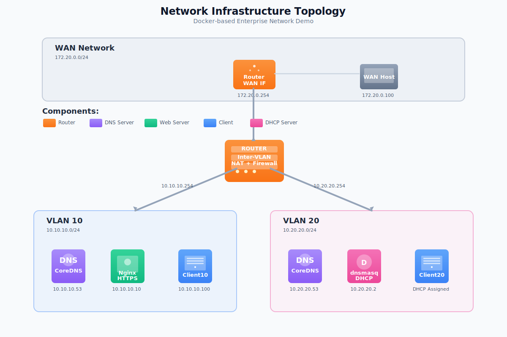

# Network Infrastructure Demo

A comprehensive, self-contained Docker-based demonstration of enterprise networking concepts including VLAN segmentation, inter-VLAN routing, DNS, DHCP, HTTPS/TLS, NAT, and dynamic firewall rules.

> **Platform note:** Designed and tested on macOS with Docker Desktop; other hosts may require adjustments.

**Perfect for learning, teaching, or demonstrating networking concepts.**

---

## Table of Contents

- [What This Demonstrates](#what-this-demonstrates)
- [Architecture](#architecture)
- [Quick Start](#quick-start)
- [Network Visualization](#network-visualization)
- [Demo Scripts](#demo-scripts)
- [Concept Explanations](#concept-explanations)
- [Advanced Usage](#advanced-usage)
- [Troubleshooting](#troubleshooting)

---

## What This Demonstrates

| Concept | Implementation | Real-World Equivalent | OSI Layer(s) | Why it exercises that layer |
|---------|---------------|----------------------|--------------|-----------------------------|
| **VLAN Segmentation** | Docker user-defined bridges | 802.1Q VLAN tagging on switches | Layer 2 (Data Link) | Demonstrates MAC-level segmentation and broadcast domain isolation. |
| **Layer 2 Switching** | Open vSwitch with MAC learning | Enterprise Ethernet switch | Layer 2 (Data Link) | Forwards frames based on learned MAC addresses; demonstrates switching fundamentals. |
| **Inter-VLAN Routing** | Router container with IP forwarding | Layer 3 switch or router | Layer 3 (Network) | Routes IP packets between subnets and applies NAT/firewall rules. |
| **DNS Resolution** | CoreDNS authoritative server | Internal DNS infrastructure | Layer 7 (Application) | Handles name-resolution queries over UDP/TCP atop lower layers. |
| **DHCP** | dnsmasq DHCP server | DHCP server in enterprise network | Layer 7 (Application) | Negotiates leases, delivering IP/gateway/DNS options via UDP broadcasts. |
| **HTTPS/TLS** | Nginx with SSL certificates | Secure web services | Layer 7 (Application) | Terminates TLS sessions and serves encrypted HTTP content. |
| **NAT** | iptables MASQUERADE | Corporate gateway NAT | Layer 3 (Network) | Rewrites IP headers to share WAN access across private hosts. |
| **PAT/NAPT** | iptables MASQUERADE with port translation | Home router / corporate gateway | Layers 3/4 (Network/Transport) | Translates both IP addresses AND ports; multiplexes connections. |
| **Port Forwarding** | iptables DNAT rules | Expose services behind NAT | Layers 3/4 (Network/Transport) | Destination NAT to make internal services externally accessible. |
| **Port Mirroring** | Open vSwitch SPAN | Network monitoring / IDS placement | Layer 2 (Data Link) | Copies all traffic to monitoring port for analysis. |
| **Firewall** | iptables with stateful rules | Enterprise firewall/ACLs | Layers 3/4 (Network/Transport) | Filters traffic based on IP/port tuples with connection tracking. |
| **Monitoring** | Live tcpdump traffic capture | Network monitoring tools | Layers 2-4 (Data Link/Network/Transport) | Captures frames and packets to inspect link, IP, and transport headers. |

---

## Architecture



### Network Details

- **VLAN 10 (10.10.10.0/24)**: Static IP assignments, hosts DNS and HTTPS services
- **VLAN 20 (10.20.20.0/24)**: DHCP-based assignments, separate L2 domain
- **VLAN 30 (10.30.30.0/24)**: Switched network with Open vSwitch, demonstrates Layer 2 operations
- **WAN (172.20.0.0/24)**: Simulates external network access via NAT/PAT

### OSI Layer Mapping

| Component | OSI Layer(s) | How it uses that layer in the demo |
|-----------|---------------|------------------------------------|
| Router (`router`) | Layer 3 (Network) | Forwards IP packets between VLANs and the WAN while enforcing NAT/PAT and firewall policies with iptables. |
| Switch (`switch`) | Layer 2 (Data Link) | Open vSwitch that learns MAC addresses and forwards Ethernet frames; demonstrates switching, port mirroring, and flow tables. |
| CoreDNS (`coredns10`, `coredns20`) | Layer 7 (Application) | Responds to DNS queries over UDP/TCP, translating hostnames to IP addresses for clients once lower layers deliver the packets. |
| dnsmasq DHCP (`dhcp`) | Layer 7 (Application) | Negotiates DHCP leases, handing out IP, gateway, and DNS settings after the transport/network layers carry the broadcast and reply frames. |
| Nginx (`nginx`) | Layer 7 (Application) | Terminates HTTPS connections and serves content over TLS on top of TCP/IP, showcasing secure application delivery. |
| Clients (`client10`, `client20`, `client30a`, `client30b`) | Layers 2–7 (Host stack) | Initiate traffic end-to-end, exercising Layer 2 switching, IP routing, TCP/UDP transport, and application protocols. |
| WAN Host (`wanhost`) | Layer 7 (Application) | Provides a simple HTTP service on the external network that internal clients reach through routed Layer 3 connectivity and NAT/PAT. |

---

## Quick Start

### Prerequisites

- Docker Desktop for Mac (required) – install from https://www.docker.com/products/docker-desktop/
- Homebrew package manager (recommended for tooling installs) – https://brew.sh/
- `make` (included with macOS Command Line Tools)
- `jq` (required for demo output formatting) – `brew install jq`
- `mkcert` (optional, for trusted local certificates) – `brew install mkcert`
- Modern web browser (for visualization)

### Installation

```bash
# 1. Clone or navigate to the project
cd /Volumes/external/code/networkdemo

# 2. Generate SSL certificates
make certs

# 3. Start the environment
make up

# 4. Verify everything is running
make status

# 5. Open the visualization (optional)
make viz
```

### Cleanup

When you're done with the demo:

```bash
# Stop all containers
make down

# Remove everything (containers, networks, volumes)
make clean

# Complete cleanup (also removes images and certificates)
make clean-all

# Nuclear option (if something is stuck)
make force-clean
```

### Your First Demo

```bash
# Open the network visualization (optional but recommended!)
make viz

# Test DNS resolution
make demo-dns

# Test HTTPS connectivity
make demo-https

# Test inter-VLAN routing
make demo-routing

# Run all demos
make demo-all
```

### Stopping and Cleaning Up

```bash
# Stop all containers (keeps images and data)
make down

# Clean up containers, networks, volumes
make clean

# Full cleanup: remove images and certificates too
make clean-all

# Force cleanup if containers are stuck
make force-clean
```

---

## Network Visualization

The demo includes a real-time network visualization webapp that shows:
- Live topology with all containers and networks
- Real-time traffic activity with visual indicators
- Container statistics (bytes sent/received, packet counts)
- Router firewall rules
- Active connections and data flows

### Building the Visualization

The visualization webapp is built automatically when you run `make up`. To build it manually:

```bash
# Option 1: Build via docker compose
docker compose build viz

# Option 2: Build using the dedicated script
cd viz-webapp
./build.sh
```

### Accessing the Visualization

```bash
# Start the environment (builds viz automatically)
make up

# Open visualization in your browser
make viz

# Open container status dashboard in your browser
open http://localhost:8080/status
```

Or manually visit: **http://localhost:8080** for the topology view and **http://localhost:8080/status** for the container status dashboard.

### Features

**Interactive Topology:**
- Drag nodes to rearrange
- Zoom and pan to explore
- Color-coded nodes by type (router, DNS, web server, etc.)
- Network zones visually grouped

**Live Activity Monitoring:**
- Nodes pulse when sending/receiving traffic
- Real-time activity log shows traffic flows
- Network statistics update every 500ms
- Firewall rules displayed in real-time

**Demo Integration:**
Run demos in your terminal and watch the visualization update in real-time:
```bash
# In terminal: run a demo
make demo-dns

# In browser: watch DNS traffic flow between containers
```

### More Information

For detailed information about the visualization webapp, including development, troubleshooting, and API documentation, see:
- [viz-webapp/README.md](viz-webapp/README.md)

---

## Demo Guide

### Running Demos

Each demo can be run individually using the Makefile commands. The demos are designed to showcase specific networking concepts and can be customized based on your needs.

**Quick demo sequence (5-10 minutes):**
```bash
make demo-ping      # Basic connectivity
make demo-dns       # DNS resolution
make demo-https     # Secure web access
make demo-switch    # Layer 2 switching
```

**Full demo sequence (20-25 minutes):**
```bash
make demo-all       # Runs all demos in order
```

**Advanced demos:**
```bash
make demo-pat              # Port Address Translation
make demo-port-forward     # Port forwarding (DNAT)
make demo-switch-mirror    # Port mirroring (SPAN)
```

### Failure Scenario Testing

To demonstrate resilience and troubleshooting:

```bash
# Stop the router
docker stop router

# Test connectivity (will fail)
docker exec client10 ping -c2 10.20.20.53

# Restart router
docker start router
sleep 3

# Test again (should work)
docker exec client10 ping -c2 10.20.20.53
```

### Emergency Commands

If something goes wrong:

```bash
make restart        # Restart all containers
make status         # Check container health
make logs           # View all logs
docker logs router  # View specific service logs
make shell-client10 # Debug interactively
make clean && make up  # Full restart
```

---

## Demo Scripts

### 1. DNS Resolution Demo

```bash
make demo-dns
```

**Explanation:**
> CoreDNS is configured as an authoritative DNS server for the `demo.local` zone. It's dual-homed on both VLANs so clients in either network can resolve internal hostnames. This simulates split-horizon DNS in an enterprise environment.
> It operates at **OSI Layer 7 (Application)**, relying on UDP/TCP transport to deliver DNS answers once the lower layers establish connectivity.

**Technical details:**
- CoreDNS listens on `10.10.10.53` and `10.20.20.53`
- Zone file defines A records for services
- Clients use `dns` and `dns_search` Docker compose options

### 2. HTTPS Demo

```bash
make demo-https
```

**Explanation:**
> The Nginx server is configured with TLS 1.2/1.3 and serves HTTPS on port 443. Certificates are generated using mkcert for local trust (or OpenSSL for self-signed). This demonstrates proper SSL/TLS configuration and certificate chain validation.
> As an **OSI Layer 7 (Application)** service, it rides on TCP sessions established across the routed network path.

**Technical details:**
- Nginx serves on `10.10.10.10:443`
- HTTP redirects to HTTPS (301)
- SNI, security headers, HTTP/2 enabled
- Clients can validate cert chain (with mkcert CA) or use `-k` for self-signed

### 3. Routing Demo

```bash
make demo-routing
```

**Explanation:**
> The router container has interfaces in all three networks. Kernel IP forwarding (`net.ipv4.ip_forward=1`) is enabled and iptables rules are configured to allow inter-VLAN traffic. Traceroute shows the hop through the router at `10.10.10.254` when reaching VLAN20 from VLAN10.
> This is a classic **OSI Layer 3 (Network)** function, manipulating IP headers and forwarding decisions between separate Layer 2 domains.

**Technical details:**
- Router uses dynamic interface detection (not hardcoded)
- `iptables -A FORWARD` rules control inter-VLAN flows
- Default policy is DROP (whitelist approach)
- Stateful connection tracking with `ESTABLISHED,RELATED`

### 4. DHCP Demo

```bash
make demo-dhcp
```

**Explanation:**
> dnsmasq is configured to serve DHCP on VLAN20 with a pool of 10.20.20.100-200. Client20 uses `udhcpc` (BusyBox DHCP client) to obtain an IP, gateway (router), and DNS server. This is how most enterprise networks distribute configuration.
> The DHCP exchanges occur at **OSI Layer 7 (Application)**, broadcast over the underlying Layer 2 network and transported via UDP/IP.

**Technical details:**
- DHCP scope: `10.20.20.100-200`
- Gateway option: `10.20.20.254` (router)
- DNS option: `10.20.20.53` (CoreDNS)
- 12-hour lease time

### 5. NAT Demo

```bash
make demo-nat
```

**Explanation:**
> The router performs source NAT (MASQUERADE) for any traffic leaving to the WAN network. Internal clients appear as `172.20.0.254` when accessing external hosts. This is how enterprise networks share a single public IP among many private hosts.
> NAT modifies headers at **OSI Layer 3 (Network)** while preserving higher-layer payloads intact.

**Technical details:**
- `iptables -t nat -A POSTROUTING -o wan_if -j MASQUERADE`
- Connection tracking in `/proc/net/nf_conntrack`
- Return traffic automatically translated (stateful NAT)

### 6. Firewall Demo

```bash
make demo-firewall
```

**Explanation:**
> A default-deny policy is used on the FORWARD chain. Rules can be dynamically added to allow or block specific flows. For example, blocking VLAN20 from reaching the HTTPS service, testing it, then removing the rule demonstrates real-time firewall policy changes.
> Stateful inspection inspects Layer 3/4 tuples, illustrating **OSI Layer 3/4 (Network/Transport)** control over permitted sessions.

**Technical details:**
- Default policy: `iptables -P FORWARD DROP`
- Specific allow rules for inter-VLAN and WAN access
- Can add logging with `-j LOG` for visibility
- Rules are applied immediately (no restart needed)

### 7. Switch Demo

```bash
make demo-switch
```

**Explanation:**
> Open vSwitch provides true Layer 2 switching with MAC address learning. As clients communicate, the switch builds a forwarding database (MAC table) mapping MAC addresses to ports. This demonstrates fundamental Ethernet switching operations.
> This is a pure **OSI Layer 2 (Data Link)** function, operating on Ethernet frames rather than IP packets.

**Technical details:**
- Open vSwitch bridge: `br-switch30`
- Dynamic MAC learning (flood-and-learn)
- Flow table with statistics
- ARP resolution demonstrates Layer 2/3 interaction

### 8. PAT Demo (Port Address Translation)

```bash
make demo-pat
```

**Explanation:**
> PAT (also called NAPT - Network Address and Port Translation) extends NAT by translating both IP addresses AND port numbers. Multiple internal hosts can share a single external IP by using different source ports. The router maintains a connection tracking table mapping internal IP:port combinations to external port numbers.
> This operates at **OSI Layers 3/4 (Network/Transport)**, rewriting both IP headers and TCP/UDP port fields.

**Technical details:**
- MASQUERADE performs dynamic PAT on WAN interface
- Ephemeral port range: typically 32768-60999 (~28K ports)
- Connection tracking in `/proc/net/nf_conntrack`
- Each internal connection gets unique external port

### 9. Port Forwarding Demo (Destination NAT)

```bash
make demo-port-forward
```

**Explanation:**
> Port forwarding (DNAT) rewrites the destination address of incoming packets, allowing external hosts to access services behind NAT. For example, external port 8888 can forward to an internal service on port 80. This is how home routers expose servers, game consoles, or security cameras.
> DNAT operates at **OSI Layers 3/4 (Network/Transport)**, modifying destination IP:port tuples in the PREROUTING chain.

**Technical details:**
- PREROUTING chain handles incoming connections
- Stateful return path (connection tracking)
- Can forward different external ports to different internal services
- Supports hairpin NAT (internal clients accessing via external IP)

### 10. Port Mirroring Demo (SPAN)

```bash
make demo-switch-mirror
```

**Explanation:**
> Port mirroring (also called SPAN - Switched Port Analyzer) copies all traffic from specified ports to a monitoring port. This is essential for intrusion detection systems (IDS), network analyzers, and troubleshooting. The mirrored traffic is an exact copy, allowing passive monitoring without affecting the original flow.
> This is a **OSI Layer 2 (Data Link)** feature, copying raw Ethernet frames.

**Technical details:**
- Open vSwitch mirror configuration
- Can mirror ingress, egress, or both
- Select individual ports or all traffic
- No impact on forwarding performance

---

## Concept Explanations

### Overview

This demo showcases enterprise networking concepts using Docker containers to simulate a complete network infrastructure. It demonstrates VLAN segmentation, routing, DNS, DHCP, NAT, and firewall rules—all from the command line.

### Key Concepts

#### 1. **Separation of Concerns**
- VLANs provide L2 isolation
- Router acts as L3 gateway
- Services are single-purpose (DNS, DHCP, web)

#### 2. **Security Layers**
- Network segmentation (defense in depth)
- Firewall with default-deny policy
- TLS encryption for data in transit
- NAT hides internal addressing

#### 3. **Scalability Considerations**
- Static DNS can be replaced with DDNS
- DHCP can scale to multiple subnets
- Router can be HA pair (VRRP/HSRP)
- Could add OSPF/BGP for dynamic routing

#### 4. **Real-World Equivalents**

| Demo Component | Production Tech |
|----------------|-----------------|
| Docker bridges | Cisco VLANs with 802.1Q tagging |
| Open vSwitch | Cisco Catalyst, Juniper EX, Arista |
| iptables router | Cisco ASA, Palo Alto, pfSense |
| CoreDNS | BIND9, Windows DNS, Route53 |
| dnsmasq DHCP | ISC DHCP, Windows DHCP, Infoblox |
| Nginx HTTPS | Load balancers (F5, HAProxy, ALB) |
| OVS port mirror | Cisco SPAN, Juniper port mirroring |

### Common Questions & Answers

**Q: How does the router know which interface leads to which VLAN?**
> Docker assigns interfaces predictably (eth0, eth1, eth2) based on the order networks are attached in docker-compose.yml. The router uses simple interface detection. In production, VLAN tags (802.1Q) or interface names would be used.

**Q: What happens if the router fails?**
> In this demo, it's a single point of failure. In production, VRRP (Virtual Router Redundancy Protocol) can be deployed with two routers sharing a virtual IP. If the primary fails, the secondary takes over within seconds.

**Q: How would you secure this further?**
> - Add mutual TLS (client certificates)
> - Implement DNSSEC for zone signing
> - Use DNS-over-TLS/HTTPS for query encryption
> - Add IDS/IPS (Suricata)
> - Implement VPN tunnels between VLANs
> - Deploy zero-trust network access

**Q: How would you scale this?**
> - Replace single router with HA pair (VRRP/HSRP)
> - Add dynamic routing (OSPF/BGP)
> - Use IPAM for address management
> - Deploy load balancers for web tier
> - Implement service mesh (Istio)
> - Add centralized logging and monitoring

**Q: What's different in production?**
> - Real switches with 802.1Q VLAN tagging
> - Layer 3 switches or enterprise routers (Cisco, Juniper)
> - Hardware load balancers (F5, Citrix, Palo Alto)
> - Cloud equivalents (AWS VPC, Azure VNet, GCP VPC)
> - Centralized management (Cisco DNA, Meraki, Ansible)

**Q: Can you demonstrate firewall blocking?**
```bash
make demo-firewall
```

---

## Advanced Usage

### Access Container Shells

```bash
make shell-client10    # VLAN10 client
make shell-client20    # VLAN20 client
make shell-router      # Router
make shell-nginx       # Nginx web server
```

### Live Monitoring

```bash
# Watch traffic in real-time
make monitor

# Manual tcpdump on router
make tcpdump-router

# Check firewall stats
docker exec router iptables -L FORWARD -v -n
```

### Network Scanning

```bash
# Scan all hosts in VLAN10
make scan-vlan10

# Port scan the nginx server
make scan-nginx

# Scan from a client
docker exec client10 nmap -sV 10.10.10.10
```

### Manual Testing

```bash
# Test DNS
docker exec client10 dig @10.10.10.53 app.demo.local

# Test HTTPS
docker exec client10 curl -kv https://app.demo.local

# Test connectivity
docker exec client10 ping -c3 10.20.20.53

# Traceroute
docker exec client10 traceroute 10.20.20.2

# Check routes
docker exec client10 ip route show

# View ARP table
docker exec client10 arp -n

# Switch operations
docker exec switch ovs-vsctl show                    # Show switch configuration
docker exec switch ovs-appctl fdb/show br-switch30  # Show MAC learning table
docker exec switch ovs-ofctl dump-flows br-switch30 # Show flow statistics
docker exec switch /show-mac-table.sh                # Helper script for MAC table
docker exec switch /enable-mirror.sh                 # Enable port mirroring
docker exec switch /disable-mirror.sh                # Disable port mirroring
```

### Firewall Manipulation

```bash
# Block all ICMP (ping)
docker exec router iptables -A FORWARD -p icmp -j DROP

# Allow only specific port
docker exec router iptables -I FORWARD -p tcp --dport 80 -j ACCEPT

# Log all forwarded packets
docker exec router iptables -I FORWARD -j LOG --log-prefix "[FW] "

# View logs
docker logs router

# Flush all rules (reset)
docker exec router iptables -F FORWARD
```

### Switch Operations

```bash
# View MAC address learning table
docker exec switch ovs-appctl fdb/show br-switch30

# View OpenFlow flows
docker exec switch ovs-ofctl dump-flows br-switch30

# View port statistics
docker exec switch ovs-ofctl dump-ports br-switch30

# Enable port mirroring
docker exec switch /enable-mirror.sh

# Disable port mirroring
docker exec switch /disable-mirror.sh

# Capture mirrored traffic
docker exec switch tcpdump -i any -n icmp

# View switch configuration
docker exec switch ovs-vsctl show
```

### NAT/PAT Operations

```bash
# View NAT rules
docker exec router iptables -t nat -L -n -v

# View connection tracking table
docker exec router cat /proc/net/nf_conntrack

# Count active connections
docker exec router cat /proc/net/nf_conntrack | wc -l

# View PAT port range
docker exec router cat /proc/sys/net/ipv4/ip_local_port_range

# Add port forwarding rule
docker exec router iptables -t nat -A PREROUTING -p tcp --dport 8888 -j DNAT --to-destination 172.20.0.200:80

# Remove port forwarding rule
docker exec router iptables -t nat -D PREROUTING -p tcp --dport 8888 -j DNAT --to-destination 172.20.0.200:80
```

---

## Troubleshooting

### Issue: Certificates not trusted

**Solution 1 (mkcert):**
```bash
brew install mkcert
mkcert -install
make clean-all
make certs
make up
```

**Solution 2 (accept self-signed):**
```bash
# Use -k flag with curl
docker exec client10 curl -k https://app.demo.local
```

### Issue: DHCP not working on client20

Check logs:
```bash
docker logs client20
docker logs dnsmasq
```

Manually request DHCP:
```bash
docker exec client20 udhcpc -i eth0 -f -v
```

### Issue: DNS not resolving

Test DNS directly:
```bash
# Query CoreDNS
docker exec client10 dig @10.10.10.53 app.demo.local

# Check CoreDNS logs
docker logs coredns

# Verify zone file
docker exec coredns cat /zones/demo.local
```

### Issue: No connectivity between VLANs

Check router:
```bash
# Verify IP forwarding
docker exec router cat /proc/sys/net/ipv4/ip_forward  # Should be 1

# Check firewall rules
docker exec router iptables -L FORWARD -v -n

# Test manually
docker exec client10 ping 10.20.20.53
```

### Issue: Containers not starting

```bash
# Check status
docker compose ps

# View logs for specific service
docker compose logs coredns
docker compose logs router

# Rebuild from scratch
make clean-all
make certs
make up
```

### Issue: Visualization not loading

```bash
# Check if viz container is running
docker ps | grep viz-webapp

# View visualization logs
docker logs viz-webapp

# Rebuild visualization
make build-viz

# Restart just the viz container
docker restart viz-webapp

# Access directly
curl http://localhost:8080
```

### Issue: Visualization shows no data

```bash
# Verify other containers are running
docker ps

# Check Docker socket mount
docker inspect viz-webapp | grep docker.sock

# Restart with verbose logs
docker logs -f viz-webapp
```

---

## Additional Resources

### Learn More

- **Docker Networking**: https://docs.docker.com/network/
- **iptables Tutorial**: https://www.frozentux.net/iptables-tutorial/iptables-tutorial.html
- **CoreDNS Docs**: https://coredns.io/manual/toc/
- **Nginx SSL Config**: https://ssl-config.mozilla.org/

### Extend This Demo

Ideas for enhancement:
1. **Add OSPF routing** using FRRouting
2. **Implement VPN** with OpenVPN or WireGuard
3. **Add IDS/IPS** with Suricata connected to mirror port
4. **Load balancing** with HAProxy
5. **Monitoring** with Prometheus + Grafana
6. **Log aggregation** with ELK stack
7. **Service mesh** with Istio
8. **QoS/Traffic shaping** with tc (traffic control)
9. **802.1Q VLAN tagging** with explicit trunk ports

---

## Makefile Commands Reference

### Setup and Management
```bash
make help           # Show all available commands
make certs          # Generate SSL certificates
make build          # Build all Docker images
make build-viz      # Build only visualization webapp
make up             # Start all containers
make down           # Stop all containers
make restart        # Restart all containers
make status         # Show container status
make logs           # View all logs
make monitor        # Watch live traffic
make viz            # Open network visualization
```

### Cleanup Commands
```bash
make clean          # Remove containers, networks, volumes
make clean-all      # Remove everything including images and certs
make force-clean    # Nuclear option - removes all traces
```

### Demos
```bash
make demo-dns            # DNS resolution demo
make demo-https          # HTTPS demo
make demo-ping           # Connectivity demo
make demo-routing        # Inter-VLAN routing demo
make demo-dhcp           # DHCP demo
make demo-nat            # NAT demo
make demo-pat            # Port Address Translation demo
make demo-firewall       # Firewall demo
make demo-switch         # Layer 2 switching demo
make demo-port-forward   # Port forwarding (DNAT) demo
make demo-switch-mirror  # Port mirroring (SPAN) demo
make demo-all            # Run all demos

# Shell access
make shell-client10  # Access VLAN10 client
make shell-client20  # Access VLAN20 client
make shell-client30a # Access VLAN30 client A
make shell-client30b # Access VLAN30 client B
make shell-router    # Access router
make shell-switch    # Access switch
make shell-nginx     # Access nginx

# Diagnostics
make scan-vlan10    # Network scan VLAN10
make scan-nginx     # Port scan nginx
make health         # Health check all services
```

### Cleanup Order

For a complete reset of the demo environment:

```bash
# 1. Stop everything
make down

# 2. Remove all artifacts
make clean-all

# 3. (Optional) If containers are stuck or issues persist
make force-clean

# 4. Rebuild from scratch
make certs
make up
```

---

## License

This is a demonstration project for educational purposes. Feel free to use, modify, and share.

---

## Contributing

Found a bug or have an improvement? Feel free to:
1. Test the change locally
2. Update documentation
3. Share your enhancements

---

## Additional Demo Commands

### Inspect Zone Files
```bash
cat coredns/demo.local.zone      # View DNS records
cat dnsmasq/dnsmasq.conf         # View DHCP configuration
cat nginx/default.conf           # View Nginx configuration
```

### Show Certificate Details
```bash
docker exec client10 sh -c "echo | openssl s_client -connect 10.10.10.10:443 2>/dev/null | openssl x509 -noout -text | grep -A2 'Subject:'"
```

### Monitor Live Traffic
```bash
make monitor                     # Watch packets in real-time
make tcpdump-router              # Detailed packet capture
```

---

## Notes

This demo is designed for educational purposes and technical presentations. It showcases core networking concepts in a portable, reproducible environment using Docker.

